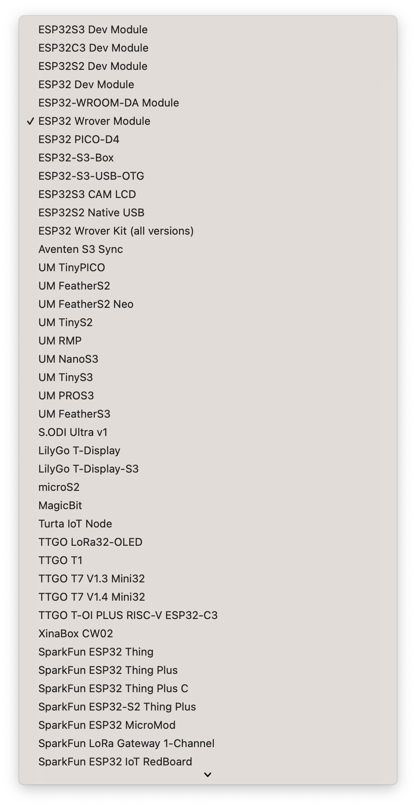
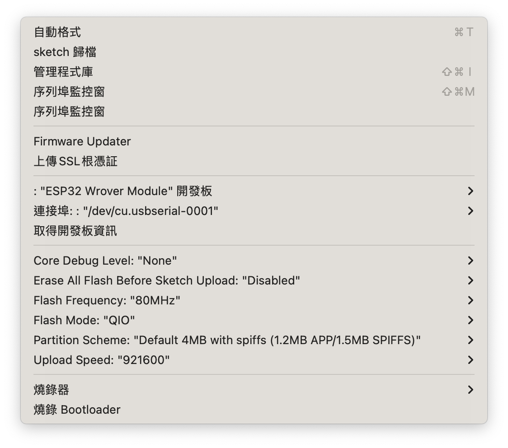

# ESP32CAM-Bulldozer
提供夜市小霸王版本的ESP32CAM與Miniplan電池組整合的版本

This Repository is used for ESP32 CAM module with Miniplan Battery shield. Of course, you can use V7RC with WIFI conection to control this module.

## Getting Start

Environment: Arduino IDE 2.0 or above. The current version we used is 2.3.2.
ESP32 Lib: Version 3.0.3, the setting URL is :  https://espressif.github.io/arduino-esp32/package_esp32_index.json 
ESP32 Board Module: ESP32 Wrover Module board.

ESP32 Board Information:
- Core Debug Level: "None"
- Erase All Flash Before Sketch Uploaded: "Disabled"
- Flash Frequency: "80MHz"
- Flash Mode: "QIO"
- Partition Scheme: "Default 4MB with Spiffs (1.2MB APP / 1.5MB SPIFFS)
- Upload Speed: "921600"

